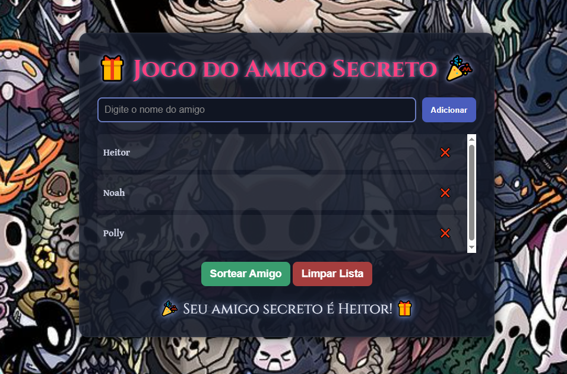

# 🎁 Jogo do Amigo Secreto 🎉

Um jogo simples e divertido de **Amigo Secreto**, desenvolvido em **HTML, CSS e JavaScript**, com deploy feito na **Vercel**.  
Neste jogo, o usuário pode adicionar amigos a uma lista, remover nomes, limpar todos os participantes e realizar o sorteio de forma interativa para saber quem é o seu **Amigo Secreto**.  

👉 Acesse o jogo online: [Gameplay Amigo Secreto](https://gameplay-amigo-secreto.vercel.app/)

---

## ✨ Funcionalidades

- 📝 Adicionar amigos à lista.
- ❌ Remover amigos individualmente.
- 🔄 Limpar toda a lista com um clique.
- 🎲 Sortear um amigo secreto aleatoriamente.
- 🎨 Tema visual estilizado inspirado em Hollow Knight.

---

## 🖼️ Demonstração

### 📸 Capturas de Tela

#### Tela inicial do jogo:

#### Sorteio realizado:

### 🎬 Vídeo de Demonstração

👉🎥 Clique na imagem acima para assistir no YouTube.

---

## 🌍 Deploy

Este projeto está disponível online graças ao Vercel:
🔗 https://gameplay-amigo-secreto.vercel.app/

---

## 🛠️ Tecnologias Utilizadas

- **HTML5** → estrutura do jogo.  
- **CSS3** → estilização, tema dark fantasy, responsividade.  
- **JavaScript (ES6)** → lógica do sorteio e gerenciamento da lista.  
- **Google Fonts** → para tipografia temática.
- **Vercel** → deploy do projeto.

---

## 📂 Estrutura do Projeto

- │── index.html
- │── css/
- │ └── style.css
- │── js/
- │ └── script.js
- │── img/
- │ ├── background.jpg
- │ ├── screenshot1.png
- │ ├── screenshot2.png

---

## 📜 Licença

Este projeto é de uso livre para fins de estudo e diversão.
Contribuições são bem-vindas! 😃

---

## 👨‍💻 Autor

Projeto desenvolvido por [Flavio Pinheiro](https://github.com/FlavioHN) 🚀
